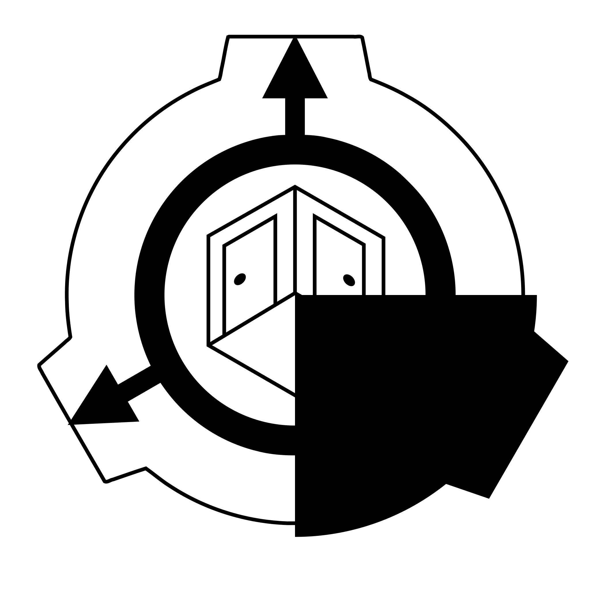

  
  <h1>CBRE-EX</h1>
  
  
  
  
  
  
  

> OMGGGG!!!!! IT DOESNT HAVE MODEL BAKING YET WHAAAAT????? THIS SUCKS!!!

CBRE-EX is a fork of CBRE that adds a bunch of quality-of-life features.

<h2>Download</h2>

You can grab the latest release from the Releases tab manually, or click [here](https://github.com/AestheticalZ/cbre-ex/releases/) instead.

CBRE-EX has an automatic updater, so this is probably the only time you will need to visit this page!

<h2>License Information</h2>

The Editor is licensed under the GNU General Public License, version 2.0.  
All other components are licensed under the GNU Lesser General Public License, version 2.1, unless otherwise stated.

Editor sidebar icons are taken from Sledge, which is licensed under BSD-3.   
Editor logo is a modified version of the SCP Wiki logo, which is licensed under the CC-BY-SA 3.0 license.

<h2>External Repositories</h2>

You can find the source code for Sledge at https://github.com/LogicAndTrick/sledge  
You can find the source code of the original CBRE at https://github.com/SCP-CBN/cbre
