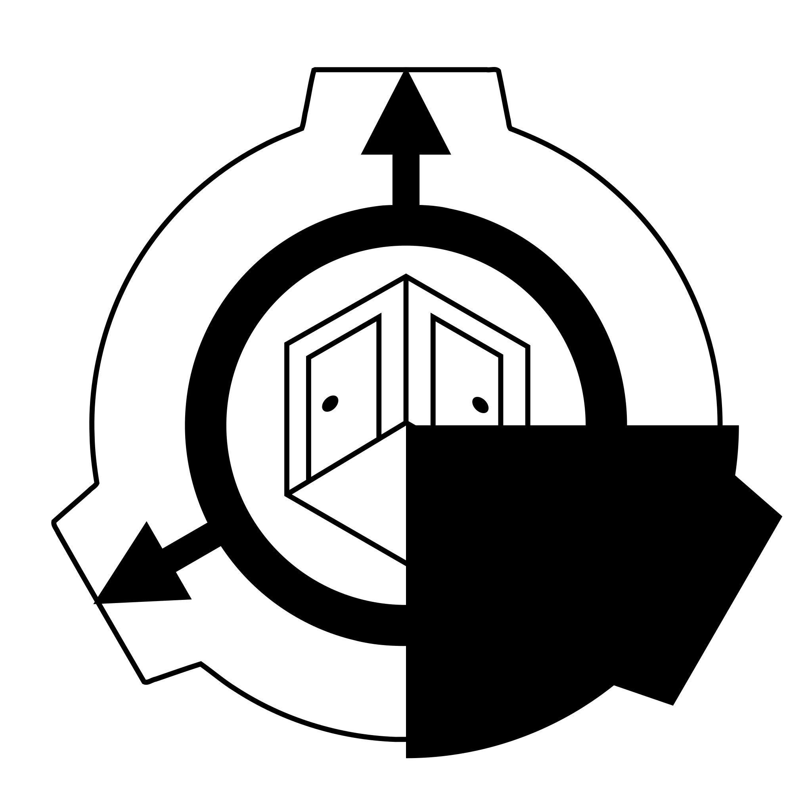

  
  <h1>CBRE-EX</h1>
  
   
   
   
   
   
   

CBRE-EX is a fork of CBRE that greatly improves user experience, and adds many nice things.  
It was created because the development of the original CBRE has ceased completely.

If you're still insane enough to mod SCP: CB, this piece of software is perfect for you.

## :question: What Is This?

CBRE-EX is a CSG mapping tool for the game [SCP - Containment Breach](https://scpcbgame.com/), a YouTube horror letsplay classic from 2012.  
The alternative, **3D World Studio**, is proprietary and only runs on Windows 7 and lower. It's also slower. Thus, a replacement had to be made.

**juanjp600** forked Sledge, a GoldSrc mapping tool, to adapt it to SCP - CB. Eventually, the project got cancelled, and I forked CBRE to
continue developing it. It is now called CBRE-EX.

## :globe_with_meridians: Download

You can grab the latest release from the **Releases** tab manually, or click [here](https://github.com/AestheticalZ/cbre-ex/releases/) instead.

CBRE-EX has an automatic updater, so this is probably the only time you will need to visit this page!

## :heart: Thanks

These are credits for people who have contributed greatly to the project.

- **LogicAndTrick** - The original creator of Sledge, the software CBRE (and thus, CBRE-EX) are based on.
- **juanjp600** - Creator of CBRE, originally known as SledgeCB.
- **Saalvage** - Helped with CBRE development.
- **VirtualBrightPlayz** - Creator of another CBRE fork, he wrote the model baking code.

# :balance_scale: License Information

The Editor is licensed under the GNU General Public License, version 2.0.  
All other components are licensed under the GNU Lesser General Public License, version 2.1, unless otherwise stated.

Editor sidebar icons are taken from **Sledge**, which is licensed under BSD-3.   
Editor logo is a modified version of **The SCP Foundation** Wiki logo, which is licensed under the CC-BY-SA 3.0 license.
